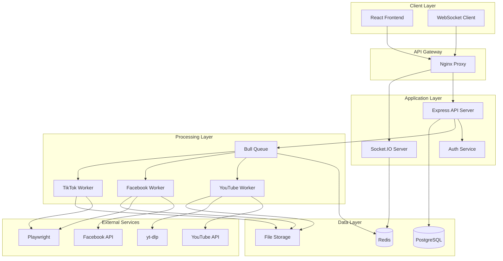

# Star Export Architecture Documentation

## System Overview

Star Export is a multi-platform social media data export application built with a microservices-inspired architecture. The system consists of a React frontend, Node.js backend API, PostgreSQL database, Redis queue, and various export services.



## Core Components

### 1. Frontend (React + TypeScript)

#### Architecture Pattern
- **Component-Based**: Modular, reusable UI components
- **State Management**: Zustand for global state
- **Routing**: React Router with lazy loading
- **Data Fetching**: TanStack Query for server state

#### Key Design Decisions
- **TypeScript**: Full type safety across the application
- **Tailwind CSS**: Utility-first styling with custom theme
- **Vite**: Fast build times and HMR
- **Code Splitting**: Lazy loading for optimal performance

#### State Architecture
```typescript
// Global State Structure
interface AppState {
  // Authentication
  auth: {
    isAuthenticated: boolean;
    user: User | null;
    tokens: Map<Platform, Token>;
  };
  
  // Export Management
  exports: {
    jobs: Map<JobId, ExportJob>;
    activeExports: Set<JobId>;
    history: ExportJob[];
  };
  
  // UI State
  ui: {
    theme: 'light' | 'dark';
    notifications: Notification[];
    selectedPlatform: Platform | null;
    exportFormat: ExportFormat;
  };
}
```

### 2. Backend (Node.js + Express)

#### Architecture Pattern
- **Layered Architecture**: Controllers → Services → Repositories
- **Middleware Pipeline**: Authentication, validation, error handling
- **Dependency Injection**: Service locator pattern
- **Event-Driven**: Job queue for async processing

#### API Design Principles
- **RESTful**: Resource-based URLs, HTTP verbs
- **Stateless**: JWT for authentication
- **Versioned**: API versioning support
- **Rate Limited**: Per-user and per-IP limits

#### Service Layer
```typescript
// Service Architecture
interface ExportService {
  startExport(userId: string, config: ExportConfig): Promise<Job>;
  getExportStatus(jobId: string): Promise<JobStatus>;
  cancelExport(jobId: string): Promise<void>;
  downloadExport(jobId: string): Promise<Stream>;
}

// Platform-specific implementations
class YouTubeExportService implements ExportService { }
class FacebookExportService implements ExportService { }
class TikTokExportService implements ExportService { }
```

### 3. Database Design (PostgreSQL)

#### Schema Design Principles
- **Normalized**: 3NF for data integrity
- **Encrypted**: Sensitive data encrypted at rest
- **Auditable**: Created/updated timestamps
- **Indexed**: Optimized for common queries

#### Key Tables
```sql
-- Users table
CREATE TABLE users (
    id UUID PRIMARY KEY DEFAULT gen_random_uuid(),
    email VARCHAR(255) UNIQUE NOT NULL,
    password_hash VARCHAR(255),
    created_at TIMESTAMP DEFAULT NOW(),
    updated_at TIMESTAMP DEFAULT NOW()
);

-- Platform integrations
CREATE TABLE platform_integrations (
    id UUID PRIMARY KEY DEFAULT gen_random_uuid(),
    user_id UUID REFERENCES users(id),
    platform VARCHAR(50) NOT NULL,
    access_token TEXT, -- encrypted
    refresh_token TEXT, -- encrypted
    expires_at TIMESTAMP,
    UNIQUE(user_id, platform)
);

-- Export jobs
CREATE TABLE exports (
    id UUID PRIMARY KEY DEFAULT gen_random_uuid(),
    user_id UUID REFERENCES users(id),
    platform VARCHAR(50) NOT NULL,
    format VARCHAR(20) NOT NULL,
    status VARCHAR(20) DEFAULT 'queued',
    progress INTEGER DEFAULT 0,
    metadata JSONB,
    started_at TIMESTAMP,
    completed_at TIMESTAMP,
    created_at TIMESTAMP DEFAULT NOW()
);

-- Indexes for performance
CREATE INDEX idx_exports_user_status ON exports(user_id, status);
CREATE INDEX idx_exports_created_at ON exports(created_at DESC);
```

### 4. Queue System (Bull + Redis)

#### Queue Architecture
```javascript
// Job Queue Structure
const exportQueue = new Bull('exports', {
  redis: REDIS_CONFIG,
  defaultJobOptions: {
    attempts: 3,
    backoff: {
      type: 'exponential',
      delay: 2000
    },
    removeOnComplete: false,
    removeOnFail: false
  }
});

// Worker Pool
exportQueue.process('youtube', 2, youtubeProcessor);
exportQueue.process('facebook', 2, facebookProcessor);
exportQueue.process('tiktok', 1, tiktokProcessor);
```

#### Job Lifecycle
1. **Created**: Job added to queue
2. **Active**: Worker processing job
3. **Progress**: Real-time updates via WebSocket
4. **Completed/Failed**: Final state with results

### 5. Export Services

#### YouTube Export Architecture
```typescript
class YouTubeExporter {
  private api: YouTubeAPI;
  private ytdlp: YtDlpWrapper;
  
  async export(config: ExportConfig): AsyncIterator<ExportItem> {
    // 1. Fetch metadata via API
    const playlists = await this.api.getPlaylists();
    const videos = await this.api.getVideos();
    
    // 2. Download media with yt-dlp
    for (const video of videos) {
      if (config.includeMedia) {
        await this.ytdlp.download(video.url, config.quality);
      }
      yield { type: 'video', data: video };
    }
  }
}
```

#### Browser Automation (Facebook/TikTok)
```typescript
class BrowserExporter {
  private browser: Browser;
  
  async initialize(cookies: Cookie[]): Promise<void> {
    this.browser = await playwright.chromium.launch({
      headless: true,
      args: ['--disable-blink-features=AutomationControlled']
    });
    
    const context = await this.browser.newContext({
      userAgent: this.randomUserAgent(),
      viewport: { width: 1920, height: 1080 }
    });
    
    await context.addCookies(cookies);
  }
  
  async scrape(url: string): Promise<PageData> {
    const page = await this.context.newPage();
    await this.humanizeInteraction(page);
    await page.goto(url, { waitUntil: 'networkidle' });
    // Extract data...
  }
}
```

## Security Architecture

### 1. Authentication & Authorization
- **JWT Tokens**: Stateless authentication
- **Refresh Tokens**: Secure token rotation
- **OAuth2**: Platform integrations
- **RBAC**: Role-based access control

### 2. Data Protection
```typescript
// Encryption Service
class EncryptionService {
  private algorithm = 'aes-256-gcm';
  private key: Buffer;
  
  encrypt(text: string): EncryptedData {
    const iv = crypto.randomBytes(16);
    const cipher = crypto.createCipheriv(this.algorithm, this.key, iv);
    
    const encrypted = Buffer.concat([
      cipher.update(text, 'utf8'),
      cipher.final()
    ]);
    
    return {
      encrypted: encrypted.toString('base64'),
      iv: iv.toString('base64'),
      tag: cipher.getAuthTag().toString('base64')
    };
  }
}
```

### 3. API Security
- **Rate Limiting**: Token bucket algorithm
- **Input Validation**: Joi schemas
- **CORS**: Whitelist origins
- **Helmet**: Security headers
- **SQL Injection**: Parameterized queries

## Performance Optimizations

### 1. Frontend Performance
- **Code Splitting**: Route-based chunks
- **Lazy Loading**: Components and images
- **Memoization**: React.memo and useMemo
- **Virtual Scrolling**: Large lists
- **Service Worker**: Offline support

### 2. Backend Performance
- **Connection Pooling**: Database connections
- **Caching**: Redis for frequent queries
- **Compression**: Gzip responses
- **Streaming**: Large file downloads
- **Pagination**: Cursor-based pagination

### 3. Database Optimizations
```sql
-- Composite indexes
CREATE INDEX idx_exports_user_platform_status 
ON exports(user_id, platform, status);

-- Partial indexes
CREATE INDEX idx_active_exports 
ON exports(user_id, created_at DESC) 
WHERE status IN ('queued', 'processing');

-- Query optimization
EXPLAIN ANALYZE
SELECT * FROM exports
WHERE user_id = $1
  AND status = 'completed'
ORDER BY created_at DESC
LIMIT 10;
```

## Scalability Considerations

### 1. Horizontal Scaling
- **Stateless API**: Multiple instances
- **Queue Workers**: Distributed processing
- **Database**: Read replicas
- **Redis**: Cluster mode

### 2. Vertical Scaling
- **Worker Concurrency**: Adjustable
- **Connection Pools**: Configurable
- **Memory Management**: Stream processing
- **CPU Utilization**: Worker threads

### 3. Cloud Architecture
```yaml
# Kubernetes Deployment
apiVersion: apps/v1
kind: Deployment
metadata:
  name: star-export-api
spec:
  replicas: 3
  selector:
    matchLabels:
      app: star-export-api
  template:
    spec:
      containers:
      - name: api
        image: star-export/api:latest
        resources:
          requests:
            memory: "512Mi"
            cpu: "500m"
          limits:
            memory: "1Gi"
            cpu: "1000m"
```

## Monitoring & Observability

### 1. Application Metrics
```typescript
// Prometheus metrics
const httpRequestDuration = new Histogram({
  name: 'http_request_duration_seconds',
  help: 'Duration of HTTP requests in seconds',
  labelNames: ['method', 'route', 'status']
});

const exportJobsTotal = new Counter({
  name: 'export_jobs_total',
  help: 'Total number of export jobs',
  labelNames: ['platform', 'status']
});
```

### 2. Logging Strategy
- **Structured Logging**: JSON format
- **Log Levels**: ERROR, WARN, INFO, DEBUG
- **Correlation IDs**: Request tracing
- **Log Aggregation**: ELK stack

### 3. Health Checks
```typescript
// Comprehensive health check
app.get('/health', async (req, res) => {
  const health = {
    status: 'healthy',
    checks: {
      database: await checkDatabase(),
      redis: await checkRedis(),
      storage: await checkStorage(),
      memory: process.memoryUsage(),
      uptime: process.uptime()
    }
  };
  
  const isHealthy = Object.values(health.checks)
    .every(check => check.status === 'ok');
    
  res.status(isHealthy ? 200 : 503).json(health);
});
```

## Disaster Recovery

### 1. Backup Strategy
- **Database**: Daily automated backups
- **Export Files**: 30-day retention
- **Configuration**: Version controlled
- **Secrets**: Encrypted backups

### 2. Recovery Procedures
```bash
# Database recovery
pg_restore -h localhost -U postgres -d starexport backup.dump

# Redis recovery
redis-cli --rdb /backup/dump.rdb

# Application recovery
docker-compose up -d --scale api=3
```

## Future Architecture Considerations

### 1. Microservices Migration
- Export service per platform
- Separate auth service
- API gateway pattern
- Service mesh for communication

### 2. Event Sourcing
- Export events as source of truth
- Event store for audit trail
- CQRS for read/write separation
- Eventual consistency

### 3. Serverless Components
- Lambda for export processors
- S3 for file storage
- SQS for job queue
- API Gateway for routing